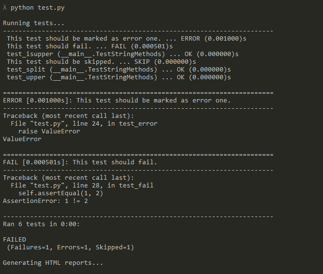
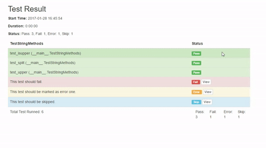

# HtmlTestRunner


[](https://pypi.python.org/pypi/html-testRunner)
[](https://travis-ci.org/oldani/HtmlTestRunner)


HtmlTest runner is a unittest test runner that save test results
in Html files, for human readable presentation of results.

This Package was inspired in ``unittest-xml-reporting`` and
``HtmlTestRunner by tungwaiyip``.

This project was created due to needs of getting human readables reports 
for test runned, i found one but was lack and with a lot of bad practice,
but i liked how ``xml-reporting`` works. So i create this one that 
incorporated code from both projects but up to date.

## Table of Content

- [Intallation](#installation)
- [Usage](#usage)
- [Console Output](#console-output)
- [Test Results](#test-result)
- [Todo](#todo)
- [Contributing](#contributing)
- [Credits](#credits)

## Installation


To install HtmlTestRunner, run this command in your terminal:

```batch

    $ pip install html-testRunner
```

This is the preferred method to install HtmlTestRunner, as it will always install the most recent stable release. If you don't have [pip](https://pip.pypa.io) installed, this [Python installation guide](http://docs.python-guide.org/en/latest/starting/installation/) can guide
you through the process.


## Usage:

```python

    import HtmlTestRunner
    import unittest


    class TestStringMethods(unittest.TestCase):
        """ Example test for HtmlRunner. """

        def test_upper(self):
            self.assertEqual('foo'.upper(), 'FOO')

        def test_isupper(self):
            self.assertTrue('FOO'.isupper())
            self.assertFalse('Foo'.isupper())

        def test_split(self):
            s = 'hello world'
            self.assertEqual(s.split(), ['hello', 'world'])
            # check that s.split fails when the separator is not a string
            with self.assertRaises(TypeError):
                s.split(2)

        def test_error(self):
            """ This test should be marked as error one. """
            raise ValueError

        def test_fail(self):
            """ This test should fail. """
            self.assertEqual(1, 2)

        @unittest.skip("This is a skipped test.")
        def test_skip(self):
            """ This test should be skipped. """
            pass

    if __name__ == '__main__':
        unittest.main(testRunner=HtmlTestRunner.HTMLTestRunner(output='example_dir'))
```

Just import `HtmlTestRunner` from package, then pass it to `unittest.main` with the `testRunner` keyword. This class have only one required parameter, with is `output` this is use to place the report of the TestCase, this is saved under a reports directory.


For does who have `test suites` it works too, just create a runner instance and call the run method with your suite. Here an example:

```python

    from unittest import TestLoader, TestSuite
    from HtmlTestRunner import HtmlTestRunner
    import ExampleTest
    import Example2Test

    example_tests = TestLoader().loadTestsFromTestCase(ExampleTests)
    example2_tests = TestLoader().loadTestsFromTestCase(Example2Test)

    suite = TestSuite([example_tests, example2_tests])

    runner = HtmlTestRunner(output='example_suite')

    runner.run(suite)

```


## Console output:



This is an example of what you got in the console.


## Test Result:



This is a sample of the results from the template that came by default with the runner. If you want to use your own template you can pass the abolute path to it when instanciating the `HtmlTestRunner` class, like `HtmlTestRunner(output='example_suite', template='path/to/template', report_title='My Report'`.
Your template must use jinja2 syntax, since this is the engine we use.


`report_title` is the title we want to appear at the top of the report. When using a custom template, these values are pass.


- `title`: This is the report name
- `headers`: This is a dict with 3 items:
    - `start_time`: When the test was run.
    - `duration`: How much it took to run
    - `status`: a string with how much test pass, fail, throw an error or were skip.
    Note: Remenber on jinja templetes dict can be access throw dot notation, e.g: `{{headers.status}}`
- `testcase_name`: The name of the Testcase class.
- `tests_results`: A list of lists, each inner list contains 4 elements, in the following order:
    - Test description or test name: If test does not have docs string, test name is used.
    - Status: Could be one of ('success', 'danger', 'warning', 'info')
    - Error type
    - Error message
- `total_tests`: The amount of tests run


You can access these values a vars, for rendering just surround it with `{{ var }}`, for `tests_results` you need to iterate it. Click [here](docs/example_template.html) for a template example, this is the default one shipped with the package.


## TODO

- [ ] Add Test
- [ ] Improve documentation
- [x] Add custom templates
- [ ] Add xml results
- [ ] Add support for Python2.7
- [ ] Add support for one report when running test suites.

## Contributing

Contributions are welcome, and they are greatly appreciated! Every
little bit helps, and credit will always be given.

For more info please click [here](./CONTRIBUTING.md)

## Credits

This package was created with Cookiecutter and the `audreyr/cookiecutter-pypackage` project template.

- [Cookiecutter](https://github.com/audreyr/cookiecutter)
- [audreyr/cookiecutter-pypackage](https://github.com/audreyr/cookiecutter-pypackage)

